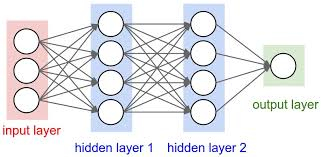

INPUT LAYER:
	The input layer of a neural network is composed of artificial input neurons, and brings the initial data into the system for further processing by subsequent layers of artificial neurons. The input layer is the very beginning of the workflow for the artificial neural network.
  
HIDDEN LAYER:
	A hidden layer is located between the input and output of the algorithm, in which the function applies weights to the inputs and directs them through an activation function as the output. In short, the hidden layers perform nonlinear transformations of the inputs entered into the network.
  
OUTPUT LAYER:
	The output layer is responsible for producing the final result. There must always be one output layer in a neural network. The output layer takes in the inputs which are passed in from the layers before it, performs the calculations via its neurons and then the output is computed.

Completed
