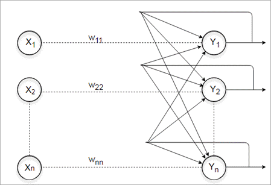

Hello Everyone :wave:

&nbsp;&nbsp;&nbsp;&nbsp;&nbsp;&nbsp;&nbsp;&nbsp; In this blog we will discuss on different types of artificial neural networks. The neural networks are designed by the programmer as per the requirements to solve a perticular problem.
Neural Networks are devided into many types, some of them are listed here below:

1. **Feed-Forward Neural Network:**

&nbsp;&nbsp;&nbsp;&nbsp;&nbsp;&nbsp;&nbsp;&nbsp;&nbsp;&nbsp;&nbsp;&nbsp;&nbsp;&nbsp;&nbsp;&nbsp;&nbsp;&nbsp;&nbsp;&nbsp;&nbsp;&nbsp;&nbsp;&nbsp;&nbsp;&nbsp;&nbsp;&nbsp;&nbsp;&nbsp;&nbsp;&nbsp;&nbsp;&nbsp;&nbsp;&nbsp;&nbsp;&nbsp;&nbsp;&nbsp;&nbsp;&nbsp;&nbsp;&nbsp;&nbsp;&nbsp;&nbsp;&nbsp; 

The feedforward neural network was the first and simplest type of artificial neural network devised. In this network, the information moves in only one direction—forward—from the input nodes, through the hidden nodes (if any) and to the output nodes. There are no cycles or loops in the network.[[wikipedia]](https://en.wikipedia.org/wiki/Feedforward_neural_network)

Here each node of one layer connected to all the nodes of adjecent layer.

2. **Convolutional Neural Network:**

&nbsp;&nbsp;&nbsp;&nbsp;&nbsp;&nbsp;&nbsp;&nbsp;&nbsp;&nbsp;&nbsp;&nbsp; 

3. **Recurrent Neural Network:**

&nbsp;&nbsp;&nbsp;&nbsp;&nbsp;&nbsp;&nbsp;&nbsp;&nbsp;&nbsp;&nbsp;&nbsp; 

